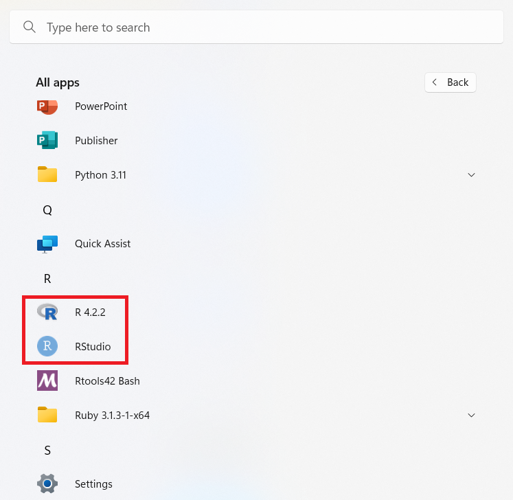
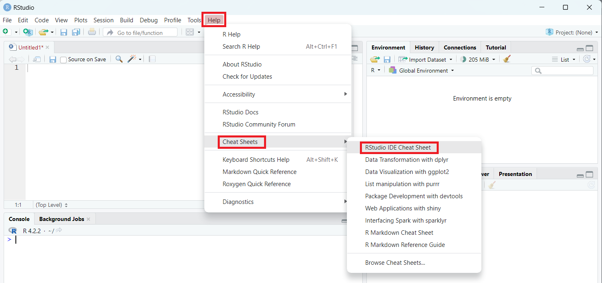

# [**What is RStudio?**](https://posit.co/products/open-source/rstudio/)

RStudio is an integrated development environment (IDE) for R, designed to provide a powerful and user-friendly interface for working with R. When you use RStudio, R executes the commands in the background. You must install R to use RStudio, but you can use R without RStudio.

Note. The RGui is the original R user interface. We will use RStudio instead, to access R during the workshop.

# RStudio Layout

The RStudio interface has a toolbar and four main panes:

### Toolbar

Located at the very top of your screen. This is where to go to format RStudio and create new files, including RScripts.

Rscripts and other Rfiles types, such as RMarkdown are documents where you can write code and save it for later. basically, the R equivalent of a word document.

### Source editor

On the top left is the **Source Editor**. If it is your first time opening RStudio, the source editor may not show up. You can click from the toolbar 'File - New File - R Script' and then a script file called Untitled1 will show up there. Writing your code in the script is recommended if you want to save your work for future use.

### Console

On the bottom left is the **Console**. It is where you can type in R commands and see the outputs. Writing your code in the console is recommended for quick exploration.

### Top right pane

The top right pane includes tabs such as Environment and History.
The **Environment** tab allows you to see what objects are in the workspace.
The **History** tab allows you to see the commands that you have entered.

### Top left pane

The bottom right pane shows tabs such as Plots, Packages and Help.
**Plot** is where you can view your plot.
**Packages** is where you can view the list of all the installed packages.
In **Help**, you can can browse the built-in help system of R, which is super helpful.

If you have questions after the workshop, a cheat sheet is available for quick referral: [RStudio IDE Cheat Sheet](https://posit.co/wp-content/uploads/2022/10/rstudio-ide-1.pdf). The cheat sheet is also accessible within RStudio through the toolbar 'Help - Cheat Sheets - RStudio IDE Cheat Sheet'.

This page is meant to be a brief introduction and we will refer to them later to help you familiarize with the interface. What questions do you have about the RStudio interface? Now is a good time for you to share your questions, thoughts and comments.
