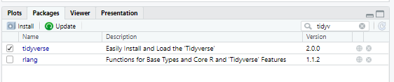
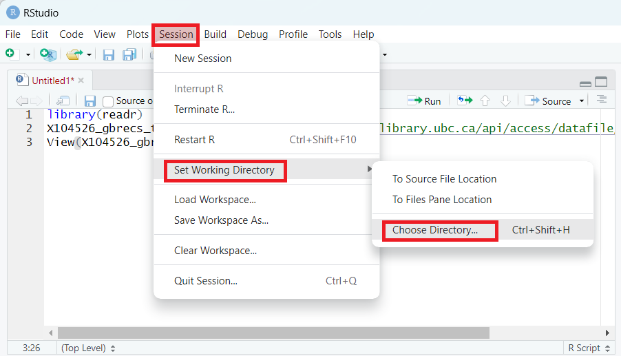
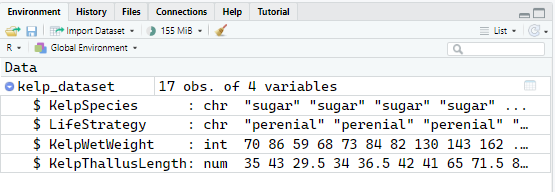

### The R coding language is similar to English

-   Code is read from left to right and from the top of the script (line 1) to the bottom of the script.

    -   This means, that your code needs to be written in the correct order to be able to run it without errors

-   Just like a book or lab protocol, there is a method to organizing your code. We outline these parts below and then go into what each of these elements are in the following sections.

    1.  Set up your R session

    2.  Formatting your data

    3.  Data analysis.

### Set up the R session

R needs some set up and some additional information before it can be expected to interact with data that it needs to analyze.

##### Set up part 1: Load in packages

-   Packages are add ons to R that allow you to use a single command to perform an action, rather than typing a bunch of code to do things. Think of them like browser extensions. You don't need browser extensions for your browser to work, but the customization packages offer make the experience of going online much better.

    Packages are **installed** the first time you use them with the `install.packages()` command. This only needs to be run once per package on your computer.

    **Every time you want to us**e the package, you need to load it into R using the `library()` command. The `library()` command should be added to your R Script.

```{r install and load package}

# install package 
install.packages("tidyverse")

# load package
library(tidyverse)
```

You can also install packages manually from RStudio by clicking the grey install button (top left of image) and start typing the name of the package in the search box that pops up.

Once you have installed a packges, you can check if it's loaded or not visually by using the search box at the top right of the picture. See how *tidyverse* has a check mark next to it? That means is loaded (we successfully ran the `library(tidyverse)` command)! See how *rlang* does not have a check mark next to it, that means it's installed, but not loaded, so we can't use any of the commands in *rlang* right now, but we can use the commands in *tidyverse*.

What if you search for a package name and it's not there? Check the spelling and if it's correct, that means the package is not installed.



##### Aside: What are #?

-   A `#` is the R symbol for a comment. Commenting out a line of code makes it not run. This is useful to make notes about why you did something (organization) or just removing part of your existing code for troubleshooting purposes.

    Putting 1 or more `#` in front of text does the same thing.

```{r}
# won't run
## same thing as above
############# still the same thing as above 
```

However, if you add at least four `#` at the end, you can create code sections. This is very helpful because it lets you collapse entire chunks fo code and makes it less overwhelming once your script get very long. The number of \# at the start does not matter and it's okay to have more than four \# at the end. I like to put five \# on each side of the title for absolutely no reason except I think it looks pretty.

```{r}
#### section 1 name ####
# section 2 name ####
## section 3 name ####
```

##### Set up part 2: Tell R where to get data

Now that R has all the packages we need loaded, we need to tell R where to look for data on your computer. Where R looks for data is called the working directory and can be customized for each RScript you make.

You can set your working directory manually by clicking Session\> Set Working Directory \> Choose Directory \> Navigate to where your data are in your files.



Once you have set your working directory manually like this, you can copy/paste the output from the console and add it to your script.

```{r}
## set working directory
setwd("C:/Users/siobh/OneDrive/Desktop")
# you need to put your own path inside the setwd() backets. 

# MAC USERS!! you will have a ~ instead of a C:
```

##### Set up part 3: Load in your data

Now that R knows where to look for files, you can read them into R.

R can read in a bunch of different files types. some like .csv and .RDS are readable from R without loading packages first. Other files types, like .xlsx and .sav need you to load packages before you can read in the files.

You can do this by typing the correct read file command into your your script or by clicking the import dataset button (image below). If you use the import dataset button, you should copy paste the output from the console in your script so you can just run the script without manually selecting the data every time.


```{r}
# read in the .csv file
kelp_dataset=read.csv("kelp_dataset.csv")
# note, + and <- are the same in this case. 
```

Now we see that the dataset is in our Environment, so it's loaded properly.


Now, we want to look at our data. We can do this with the `View()` function

```{r}
# look at the data
View(kelp_dataset)
```

##### If you clock on the name of the dataset in the environment, you can achieve the same effect as View(). However, if you click on the little blue arrow next to the dataset, you will have an overview of what your column headers are called and the variable type of each column.



You can also use the `summary()` function to get an overview of your data

```{r}
summary(kelp_dataset)
```

### 

### Format your data

Data that are not formatted properly are the source of many error messages in R. We are not going to go over data formatting today because we have many other workshops to do that.

Overall, in this section, you would clean up your data by removing parts of it you don;t want to analyze, change the variable types, [join many datasets together](https://ubc-library-rc.github.io/relational-data-r/), or [manipulate your data](https://github.com/ubc-library-rc/intro_to_tidyverse) in various other ways.

### Data Analysis

This section is really what you want to be doing when you open up R and we are finally there! The analysis you do for your own work will likely require the installation of new packages and you will have some troubleshooting to do.

Today, we will go over some of the built in functions that R has for simple data analysis.

##### Calculate the mean

Run the following line and look for the output in the console

```{r}
mean(kelp_dataset$KelpWetWeight)
# there is also sum(), median(), min(), max(), and a bunch of other similar functions
```

##### Run a correlation test

Lets see if thalus length and weight are correlated. The output for this will also be int he console.

```{r}
cor.test(kelp_dataset$KelpWetWeight, kelp_dataset$KelpThallusLength)
```

Lets plot the data we just ran the correlation test on. This output will be in the plot section of RStudio.

```{r}
plot(kelp_dataset$KelpWetWeight, kelp_dataset$KelpThallusLength)
```
